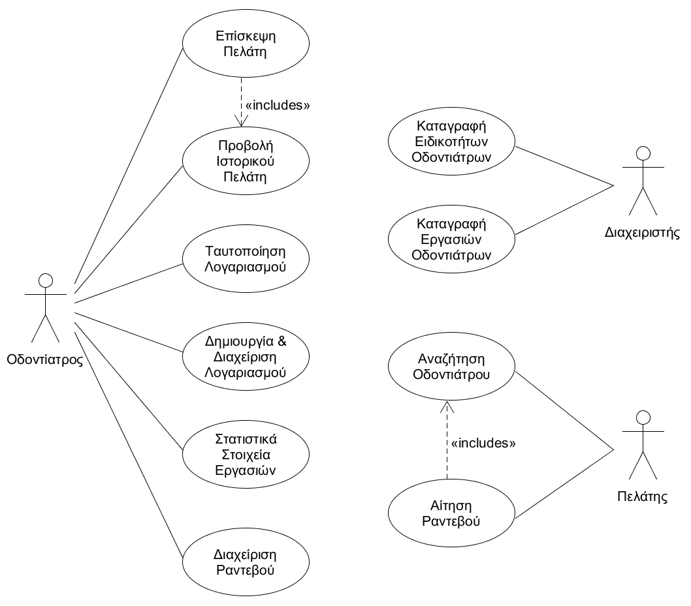

# Εφαρμογή Οδοντιατρείου

## Οι ενδιαφερόμενοι
* Οι γιατροί μέσω της εφαρμογής κρατάνε την ατζέντα των ραντεβού τους και στατιστικά που προκύπτουν από τις υπηρεσίες που παρείχαν.
* Οι πελάτες (ασθενείς) έχουν τη δυνατότητα να ψάξουν τον οδοντίατρο που ταιριάζει στις ανάγκες τους, μέσα από διάφορα φίλτρα και να αιτηθούν ραντεβού.

## Απαιτήσεις

1. Δίνεται η δυνατότητα για εγγραφή στο σύστημα από τους γιατρούς.
2. Γίνεται καταγραφή όλων των εργασιών που σχετίζονται με την ειδικότητα του οδοντιάτρου από τον διαχειριστή του συστήματος.
3. Κατά την εγγραφή αποθηκεύονται όνομα, επώνυμο, άδεια άσκησης επαγγέλματος, πανεπιστήμιο φοίτησης, τοποθεσία ιατρείου, χρόνια προϋπηρεσίας γιατρού, τηλέφωνο επικοινωνίας, ηλεκτρονική διεύθυνση και κωδικός πρόσβασης. Υποσύνολο των εργασιών-ειδικοτήτων θα επιλέγονται από τον εκάστοτε οδοντίατρο κατά την εγγραφή του στο σύστημα, έτσι ώστε να διευκολύνεται ο εντοπισμός του από πιθανούς πελάτες.
4. Το σύστημα υποστηρίζει είσοδο στους εγγεγραμμένους χρήστες, με τη χρήση της ηλεκτρονικής διεύθυνσης ως Username και του κωδικού πρόσβασης στο πλαίσιο Password, όπου και γίνεται ταυτοποίηση κατά την διαδικασία της σύνδεσης.
5. Στον οδοντίατρο θα δίνεται η δυνατότητα να αναζητήσει το ιστορικό του πελάτη, σύμφωνα με το οποίο θα βλέπει τι υπηρεσίες του έχουν παρασχεθεί.
6. Δίνεται η δυνατότητα στους οδοντιάτρους για εμφάνιση των προσωπικών στατιστικών στοιχείων τους βάσει των υπηρεσιών που έχουν προσφέρει στους ασθενείς.
7. Ο οδοντίατρος θα έχει τη δυνατότητα να προσθέσει νέα υπηρεσία, όπου θα επιλέγει όνομα πελάτη, ημερομηνία, τύπο υπηρεσίας (εξαγωγή, σφράγισμα, φαρμακευτική αγωγή, ειδικά σχόλια κτλ.)
8. Παρέχεται η δυνατότητα εμφάνισης της προσωπικής ατζέντας του οδοντιάτρου και προσθήκης ραντεβού σε αυτήν.
9. Στον πελάτη παρέχεται η δυνατότητα να κλείνει ραντεβού στον οδοντίατρο με χρήση της εφαρμογής, όπου θα πρέπει να παρέχει τα προσωπικά του στοιχεία (όνομα, επώνυμο, τηλέφωνο επικοινωνίας, ηλεκτρονική διεύθυνση). Επιπλέον, θα δίνεται η δυνατότητα ακύρωσης ενός ραντεβού. Κατά το κλείσιμο ραντεβού θα λαμβάνεται υπόψιν η διαθεσιμότητα του γιατρού για την επιλεγμένη ημέρα ώρα. (δε θα πρέπει να επικαλύπτονται τα ραντεβού)
10. Οι πελάτες έχουν τη δυνατότητα να δουν όλους τους γιατρούς που υπάρχουν στο σύστημα, με τα στατιστικά στοιχεία του καθενός, ώστε να επιλέξουν έναν γιατρό που έχει αναλάβει πολλές υποθέσεις παρόμοιες με τη δική τους. Η αναζήτηση θα μπορεί να γίνεται με τη χρήση διαφόρων φίλτρων, όπως για παράδειγμα τοποθεσία ιατρείου, ειδικότητα οδοντιάτρου, πανεπιστήμιο αποφοίτησής του, τύπος εργασίας/θεραπείας που θέλει να κάνει κτλ.
11. Κατά τη σύνδεση του γιατρού, θα εμφανίζονται αιτήματα για ραντεβού.
12. Ο γιατρός θα επιβεβαιώνει κάθε νέο ραντεβού και θα ρυθμίζει την εκτιμώμενη διάρκεια της επίσκεψης. Με τον τρόπο αυτό θα αποφεύγεται η καταχώριση νέων ραντεβού σε χρόνο μη διαθεσιμότητάς του. Ραντεβού τα οποία δεν μπορούν να εξυπηρετηθούν θα μεταφέρονται ή θα ακυρώνονται. Κατά την επιβεβαίωση/μεταφορά/ακύρωση ραντεβού θα στέλνεται σχετική ειδοποίηση στον πελάτη.
13. Στον γιατρό δίνεται η δυνατότητα διαχείρισης του λογαριασμού του.

## Use-Case Diagram

