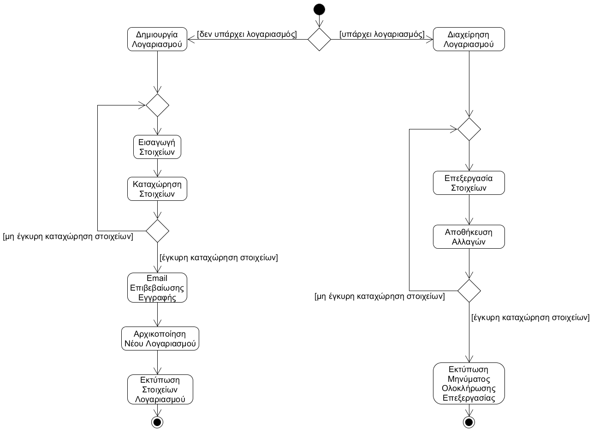
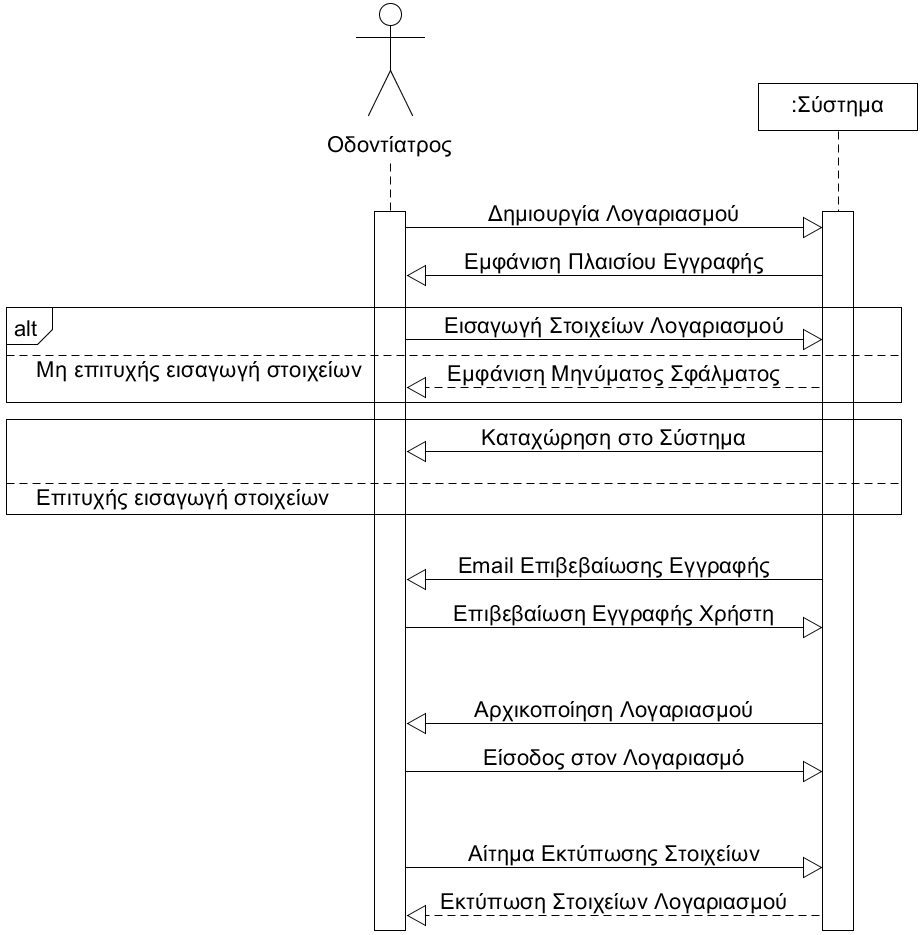
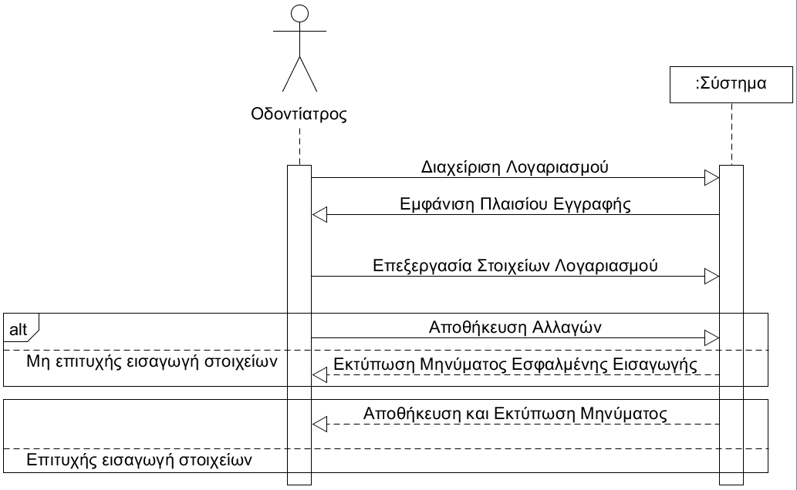

# ΠΧ4 Δημιουργία και Διαχείριση Λογαριασμού
__Πρωτεύων Actor:__
Οδοντίατρος

__Ενδιαφερόμενοι:__

Οδοντίατρος: Θέλει να έχει τη δυνατότητα εγγραφής στο σύστημα κατόπιν παροχής των στοιχείων του, καθώς επίσης και τη δυνατότητα διαχείρισης του λογαριασμού του.

__Προϋποθέσεις:__

* Ο οδοντίατρος κατά την εγγραφή του στο σύστημα καλείται να παρέχει τα προσωπικά του στοιχεία, τα οποία είναι τα ακόλουθα: Όνομα, Επώνυμο, Άδεια Άσκησης Επαγγέλματος, Πανεπιστήμιο Φοίτησης, Τοποθεσία Ιατρείου, Χρόνια Προϋπηρεσίας Γιατρού, Τηλέφωνο Επικοινωνίας, Ηλεκτρονική Διεύθυνση και Κωδικός Πρόσβασης.

* Προκειμένου να διαχειριστεί το λογαριασμό του, ο οδοντίατρος πρέπει πρώτα να έχει δημιουργήσει λογαριασμό και να έχει ταυτοποιηθεί αυτός κατά την είσοδό του στο σύστημα.

## Βασική Ροή

### Α) Δημιουργία Λογαριασμού
1. Ο οδοντίατρος επιλέγει τη δημιουργία νέου λογαριασμού οδοντιάτρου.
2. Εμφανίζεται μια φόρμα με τα αντίστοιχα πλαίσια στα οποία ο οδοντίατρος καλείται να συμπληρώσει τα στοιχεία του.
3. Ο οδοντίατρος επιβεβαιώνει και καταχωρεί τα στοιχεία του, τα οποία ύστερα εξακριβώνονται και καταχωρούνται στο σύστημα.
5. Αρχικοποιείται ο νέος λογαριασμός οδοντιάτρου.
6. Ο οδοντίατρος πραγματοποιεί είσοδο στο λογαριασμό του.
7. Εκτυπώνονται τα στοιχεία του λογαριασμού του Οδοντιάτρου.

## Εναλλακτικές Ροές
*3α. Ο οδοντίατρος εισάγει μη επιτρεπτά στοιχεία στα αντίστοιχα πλαίσια.*
   1. Η διαδικασία δημιουργίας λογαριασμού δεν ολοκληρώνεται και υπάρχει εκτύπωση του αντίστοιχου μηνύματος λάθους.
   2. Η περίπτωση χρήσης επιστρέφει στο βήμα 2.
 

### Β) Διαχείριση Λογαριασμού
1. Ο οδοντίατρος επιλέγει τη διαχείριση λογαριασμού.
2. Ο οδοντίατρος επεξεργάζεται τα στοιχεία του λογαριασμού του (Όνομα, Επώνυμο, Τηλέφωνο Επικοινωνίας κτλ.) κατά το δοκούν.
3. Ο οδοντίατρος επιλέγει την αποθήκευση στοιχείων.
4. Το σύστημα τυπώνει μήνυμα αποθήκευσης των αλλαγών.

## Εναλλακτικές Ροές
*4\. Τα νέα στοιχεία που εισήγαγε ο οδοντίατρος δεν είναι έγκυρα.*
1. Το σύστημα τυπώνει μήνυμα σφάλματος και καλεί τον χρήστη να εισάγει εκ νέου τα στοιχεία που επιθυμεί να τροποποιήσει.
2. Η περίπτωση χρήσης επιστρέφει στο βήμα 2.

# Διαγράμματα
## Διάγραμμα δραστηριότητας - Δημιουργία και Διαχείριση Λογαριασμού

## Διάγραμμα ακολουθίας - Δημιουργία και Διαχείριση Λογαριασμού

