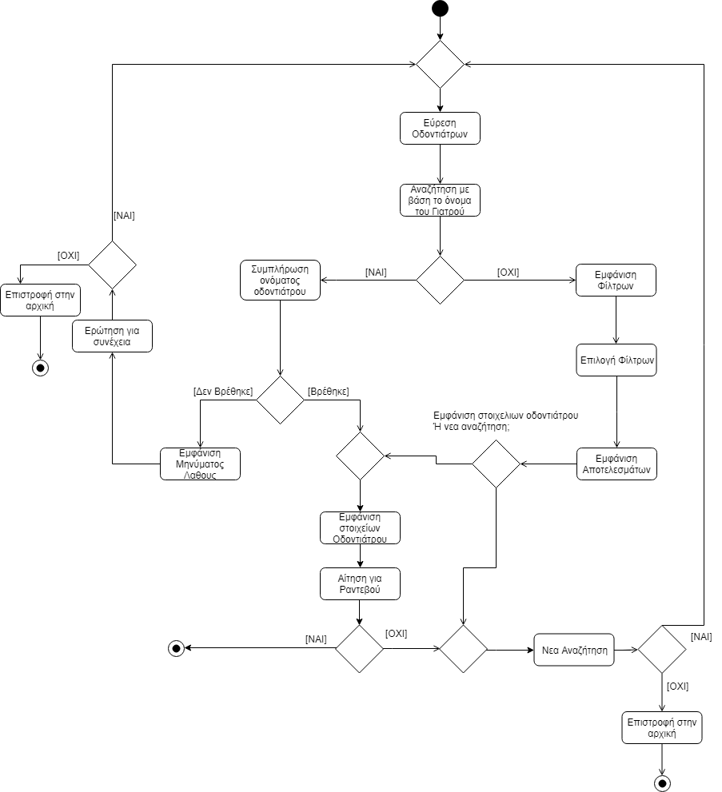
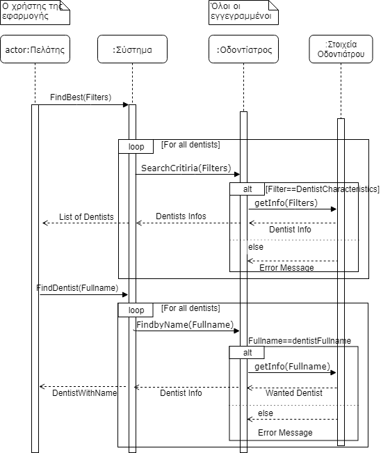

# ΠΧ9 Αναζήτηση Οδοντιάτρου

__Πρωτεύων Actor:__
Πελάτης

__Ενδιαφερόμενοι:__

Οδοντίατρος: Θέλει να βρίσκεται σε πολλές αναζητήσεις.

Πελάτης: Θέλει να έχει πολλές επιλογές που να του καλύπτουν τις ανάγκες. 

__Προϋποθέσεις:__

* Ο Πελάτης γνωρίζει κάποιους ιατρικούς όρους διαφορετικά δεν επιλέγει τα αντίστοιχα φίλτρα.

* Οι οδοντίατροι θα πρέπει μετά την εγγραφή τους να συμπληρώνουν τα στοιχεία κατά τις  [επισκέψεις των πελατών](UC1.md) ώστε να εμφανίζονται στις αναζητήσεις.

## Βασική Ροή

### Α) Αναζήτηση με βάση ονόματος 
1. Ο πελάτης επιλέγει τη αναζήτηση οδοντιάτρου.
2. Ο πελάτης εισάγει όνομα και επώνυμο γιατρού για γρήγορη αναζήτηση.
3. Ο πελάτης βλέπει τα στοιχεία οδοντιάτρου (τηλέφωνο, στατιστικά ).

## Εναλλακτικές Ροές
*3α. Ο οδοντίατρος που αναζητήθηκε δεν βρέθηκε.*
   1. Το σύστημα εμφανίζει μήνυμα που επισημαίνει το πρόβλημα.
   2. Ο πελάτης έχει την δυνατότητα να ξανααναζητήσει με βάση το όνομα ή να δοκιμάσει να αναζητήσει με την βοήθεια φίλτρων.

### Β) Αναζήτηση με Φίλτρα 
1. Ο πελάτης επιλέγει τη αναζήτηση οδοντιάτρου.
2. Ο πελάτης χρησιμοποιεί τα φίλτρα που θεωρεί πως θα τον οδηγήσουν στους καταλληλότερους οδοντιάτρους.
3. Ο πελάτης βλέπει τα στοιχεία των οδοντιάτρων.

## Εναλλακτικές Ροές
*3α. Τα φίλτρα δεν έδωσαν κανένα αποτέλεσμα.*
1. Το σύστημα εμφανίζει μήνυμα που επισημαίνει το πρόβλημα.
2. Ο πελάτης έχει την δυνατότητα να αλλάξει τα φίλτρα που χρησιμοποίησε και να ξαναδοκιμάσει.

# Διαγράμματα
## Διάγραμμα δραστηριότητας - Αναζήτηση Οδοντιάτρου

## Διάγραμμα ακολουθίας - Αναζήτηση Οδοντιάτρου
